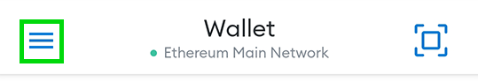

import Tabs from '@theme/Tabs';
import TabItem from '@theme/TabItem';

You've made a wallet and gotten your PRC20 tokens, now you just need to connect your wallet with DipoleSwap and you're good to go!

Check out the steps below for how to connect each of our recommended wallets to DipoleSwap.

## Smartphone/Mobile

<Tabs>
  <TabItem value="ATON" label="ATON" default>

  </TabItem>
  <TabItem value="MetaMask" label="MetaMask">

To connect MetaMask to DipoleSwap follow the steps below.

### Android and iOS

1. Open MetaMask and tap on the **burger icon** in the top-left.

2. Tap **Settings** in the menu.

3. In the Settings menu, tap on **Network**.

4. Tap on the **Add Network** button at the bottom.

5. On the page that opens, type in the following details:

**Network Name:** PlatON Chain

**RPC Url:** [https://samurai.platon.network](https://samurai.platon.network)

**Chain ID:** 210425

**Symbol:** LAT

**Block Explorer URL:** [https://scan.platon.network](https://scan.platon.network)

6. Once you've confirmed entry of the new network, go back to the burger menu and tap **Browser**.

7. Type "https://dipoleswap.exchange/" into the search field and tap to enter it.

8. You wallet will ask you to connect. Tap **Connect** to connect to DipoleSwap.

### Resources

[**Download MetaMask**](https://metamask.io/download.html) (Automatically detects device)

[**MetaMask Setup Guide**](https://metamask.io/download.html)
  </TabItem>
</Tabs>

:::danger
**Remember - NEVER, under any situation, should you ever give someone your private key or recovery phrases.**
:::
