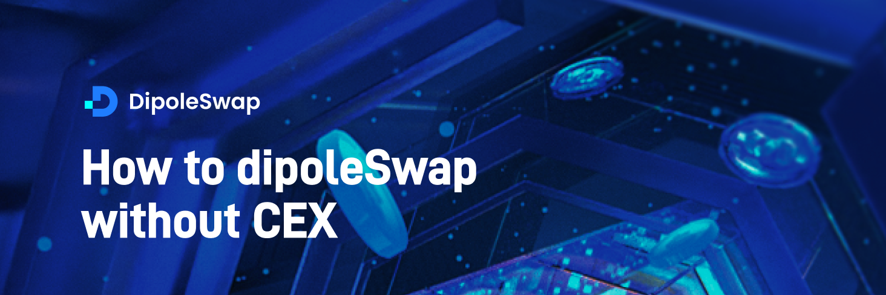

## Using DipoleSwap without Centralized Exchanges

###### You don't need an account with Binance, Coinbase, Kraken, Huobi, OKEx or any other centralized exchange to start using DipoleSwap!
---

DipoleSwap is a decentralized application. That means, unlike other centralized platforms, you don't need to register account to use it... you just need a crypto wallet. So how can you get crypto onto DipoleSwap without using a centralized exchange?

In this tutorial, we're going to guide you through the process of using "cross-chain bridges" to transfer your assets into your PlatON wallet, and start using DipoleSwap.

### **Move your assets from other blockchains to PlatON**

You can use a variety of different cross-chain bridges to transfer tokens from Ethereum or other networks, onto PlatON..


## How to add PlatON Mainnet to third-party wallets of walletconnect protocol

Connecting to the MetaMask browser plug-in wallet will guide you to automatically add the PlatON Mainnet step by step, without detailed description; there are many detailed introductions on the Internet about the installation and use of MetaMask, and I will not repeat them here.

Can refer to:

> [Installation, configuration and use of MetaMask](https://chainlink-chinese.readme.io/docs/metamask的安装-配置和使用)
>
> [How To Use MetaMask: Ethereum Wallet in your Browser](https://www.youtube.com/watch?v=ZIGUC9JAAw8)
> 
> <iframe width="100%" height="422" src='https://www.youtube.com/embed/ZIGUC9JAAw8' title="YouTube video player" frameborder="0" allow="accelerometer; autoplay; clipboard-write; encrypted-media; gyroscope; picture-in-picture" allowfullscreen></iframe>
>

The following operation instructions need to manually add the PlatON network to the tokenpocket wallet and imtoken wallet:

### Tokenpocket wallet adds PlatON network

>1.[Download Tokenpocket wallet](https://www.tokenpocket.pro/)，Go to the **[Wallet Management]** page.
>
>2.Enter **[Network Management]** in the wallet management.
>
>3.Add custom networks.
>
```
Network Name：PlatON Mainnet
RPC URL：https://samurai.platon.network
Chain ID：210425
Currency  Symbol：LAT
Block Explorer URL：https://scan.platon.network
```
>

### imtoken add PlatON network

>1.[Download imtoken wallet](https://token.im/download)，Go to **[Settings]** on the **[Me]** page.
>
>2.Use the settings page to enter **[Node Settings]**, and select **[Ethereum]**.
>
>3.Ethereum node settings Click the **[Add]** button in the upper right corner.
>
>4.Select **[Custom]** in the pop-up box to add a custom network.
>
```
Network Name：PlatON Mainnet
RPC URL：https://samurai.platon.network
Chain ID：210425
Currency  Symbol：LAT
Block Explorer URL：https://scan.platon.network
```


## Import wallets and add cross-chain asset tokens

**In order to ensure the consistency of the sending address and the receiving address, please use the [private key] import method to import Ethereum Mainnet wallet and PlatON Mainnet wallet.**

1\. Already have an Ethereum Mainnet wallet, but PlatON Mainnet does not yet have a wallet account: first export the private key of the Ethereum wallet and import it into the PlatON wallet through the private key, the HEX format (0x) address is the same;

2\. According to the Ethereum Mainnet / PlatON Mainnet blockchain network where the current wallet is located, copy the cross-chain token contract address under the network in the cross-chain browser **[Cross-chain transaction]** list, and finally, if it supports the walletconnect protocol Third-party wallets and MetaMask wallets add tokens by searching for the token contract address.


## How to perform Deposit operation

**Note: In order to ensure the consistency of the sending address and the receiving address, please use the [private key] import method to import Ethereum Mainnet wallet and PlatON Mainnet wallet;**


1\. Use a third-party wallet account and metamask wallet account that supports the walletconnect protocol, and prepare enough cross-chain assets and gas fees in advance.

2\. Visit the official cross-chain bridge webpage and enter the **[Deposit]** page of cross-chain transactions.

3\. Select the type of connection wallet such as walletconnect / MetaMask, import the Ethereum Mainnet wallet and PlatON Mainnet wallet with the private key, and connect the wallet.

4\. Select the cross-chain asset currency.

5\. Enter the  amount of cross-chain assets.

6\. Enter the address for receiving cross-chain assets. The default is the current 0x address, which supports modification (optional).

7\. Switch the network, detect the third-party wallet non-sender network (eg: Ethereum), you need to switch the wallet to the sender's network.

8\. Authorize the cross-chain contract to access the wallet account.

9\. Cross-chain deposit and transfer.


## How to perform Withdraw operation

**Note: In order to ensure the consistency of the sending address and the receiving address, please use the [private key] import method to import Ethereum Mainnet wallet and PlatON Mainnet wallet;**

1\. Use a third-party wallet account and metamask wallet account that supports the walletconnect protocol, and prepare enough cross-chain assets and gas fees in advance.

2\. Visit the official cross-chain bridge webpage and enter the **[Withdraw]** page of cross-chain transactions.

3\. Select the type of connection wallet such as walletconnect / MetaMask, import the Ethereum Mainnet wallet and PlatON Mainnet wallet with the private key, and connect the wallet.

4\. Select the cross-chain currency to redeem for withdrawal.

5\. Enter the amount of cross-chain assets withdrawn for redemption.

6\. Enter the address to receive the redeemed assets (optional).

7\. Switch the network, if it is detected that the third-party wallet is not on the PlatON network, you need to switch the wallet to the **[PlatON]** network.

8\. Authorization contract.

9\. Redemption withdrawal transfer.


## How to check transaction history

1\. After the Deposit/Withdraw transaction on the official website, click the **[View Records]** button on the left column of the current page to view the historical transaction record.

2\. In the history list, click **[Status]** in the upper right corner to jump to the official cross-chain transaction browser to view more information about the cross-chain transaction.

 


## How to confirm the correct cross-chain token

Method 1: Go to the official cross-chain bridge web page and go to the **[Help Manual]** page to view the **[Token]** trading pair information.

Method 2: Enter the cross-chain transaction browser on the official website, enter the **[transactions]** page; search the cross-chain token name in the search input box, view the sending and receiving token contract information, and copy the token contract address to the corresponding 's blockchain explorer to confirm.


## How to query cross-chain transactions

1\. Enter the official website cross-chain transaction browser and enter the **[Transactions]** page.

2\. Enter the transaction hash/send/receive address/token on the cross-chain transaction page to query cross-chain transaction information; click [Transaction Hash] in the search list to view detailed cross-chain transaction information.


## How to view the lock information of the cross-chain token contract

1\. Enter the cross-chain transaction browser on the official website and enter the **[Contract]** page.

2\. The cross-chain contract search input box searches the cross-chain token name/token contract address to view the current cross-chain contract source chain locked asset information.


