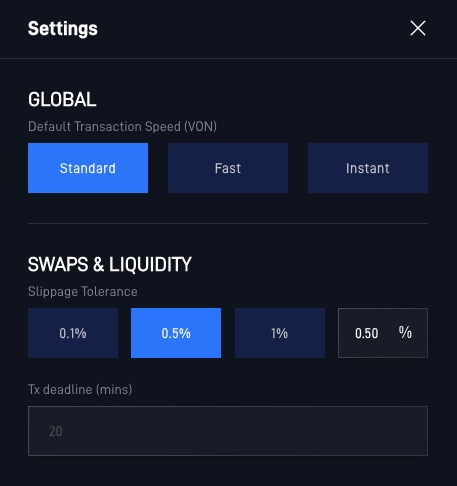
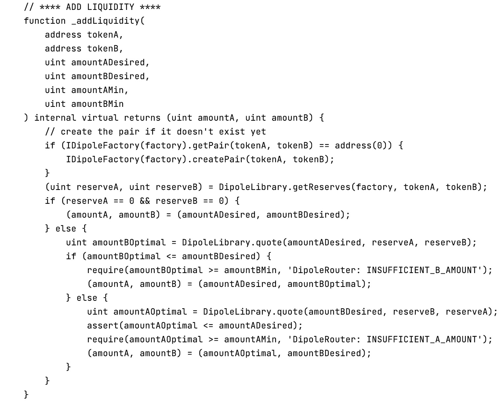
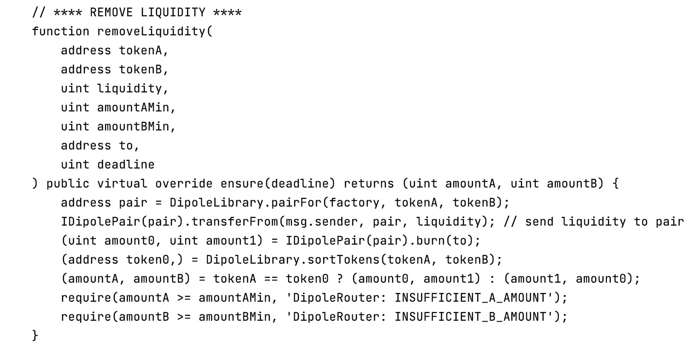
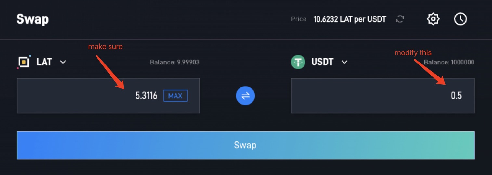

import Tabs from '@theme/Tabs';
import TabItem from '@theme/TabItem';

Sometimes you may find yourself facing a problem that doesn't have a clear solution. These troubleshooting tips may help you solve problems you run into.

## **Issues on the Exchange**

### **INSUFFICIENT\_OUTPUT\_AMOUNT**

> The transaction cannot succeed due to error: DipoleRouter: INSUFFICIENT\_OUTPUT\_AMOUNT. This is probably an issue with one of the tokens you are swapping.
>
> the transaction cannot succeed due to error: execution reverted: dipolerouter: insufficient\_output\_amount.

You're trying to swap tokens, but your slippage tolerance is too low or liquidity is too low.

<Tabs>
<TabItem value="Solution" label="Solution" default>

1. Refresh your page and try again later.
  
2. Try trading a smaller amount at one time.
  
3. Increase your slippage tolerance:
   
   1. Tap the settings icon on the liquidity page.

   2. Increase your slippage tolerance a little and try again.
   
   
     
4. Lastly, try inputting an amount with fewer decimal places.

</TabItem>
<TabItem value="Reason" label="Reason">

**This usually happens when trading tokens with low liquidity.**

That means there isn't enough of one of the tokens you're trying to swap in the Liquidity Pool: it's probably a small-cap token that few people are trading.

However, there's also the chance that you're trying to trade a scam token which cannot be sold. In this case, DipoleSwap isn't able to block a token or return funds.
  
</TabItem>
</Tabs>

### **INSUFFICIENT\_A\_AMOUNT or INSUFFICIENT\_B\_AMOUNT**

> Fail with error 'DipoleRouter: INSUFFICIENT\_A\_AMOUNT'\
> or\
> Fail with error 'DipoleRouter: INSUFFICIENT\_B\_AMOUNT'

You're trying to add/remove liquidity from a liquidity pool (LP), but there isn't enough of one of the two tokens in the pair.

<Tabs>
<TabItem value="Solution" label="Solution" default>

**Refresh your page and try again, or try again later.**

Still doesn't work?

1. Tap the settings icon on the liquidity page.
2. Increase your slippage tolerance a little and try again.

</TabItem>
<TabItem value="Reason" label="Reason">

The error is caused by trying to add or remove liquidity for a liquidity pool (LP) with an insufficient amount of token A or token B (one of the tokens in the pair).

It might be the case that prices are updating too fast when and your slippage tolerance is too low.

</TabItem>
</Tabs>

### DipoleRouter: EXPIRED

> The transaction cannot succeed due to error: DipoleRouter: EXPIRED. This is probably an issue with one of the tokens you are swapping.
Try again, but confirm (sign and broadcast) the transaction as soon as you generate it.

This happened because you started making a transaction, but you didn't sign and broadcast it until it was past the deadline. That means you didn't hit "Confirm" quickly enough.

### Dipole: K

> The transaction cannot succeed due to error: Dipole: K. This is probably an issue with one of the tokens you are swapping.

Try modifying the amount on “To” field. Therefore putting "(estimated)" symbol on “From”. Then initiate the swap immediately.

This usually happen when you are trying to swap a token with its own fee.

### **Price Impact too High**

Try trading a smaller amount, or increase slippage tolerance via the settings icon and try again. This is caused by low liquidity.

### **Execution reverted: TransferHelper: TRANSFER\_FROM\_FAILED.**

> The transaction cannot succeed due to error: execution reverted: TransferHelper: TRANSFER\_FROM\_FAILED.

When trying to swap tokens, the transaction fails and this error message is displayed. This error has been reported across platforms.

<Tabs>
<TabItem value="Soultion" label="Solution" default>

1. Check to make sure you have sufficient funds available.
   
2. Ensure you have given the contract allowance to spend the amount of funds you're attempting to trade with.

</TabItem>
<TabItem value="Reason" label="Reason">

This error happens when trading tokens with insufficient allowance, or when a wallet has insufficient funds.

</TabItem>
</Tabs>
