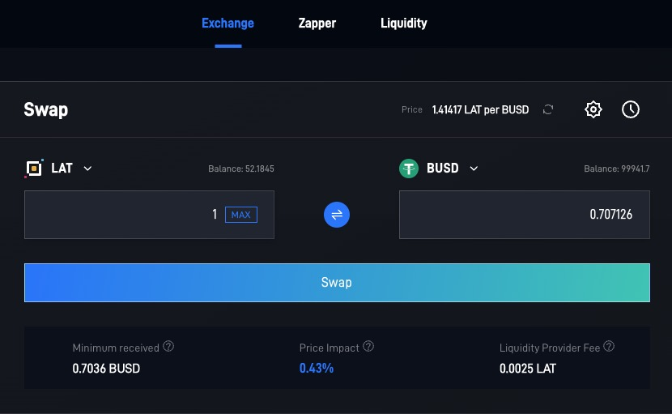

[Token swaps](https://dipoleswap.exchange/swap) on DipoleSwap are a simple way to trade one PRC-20 token for another via automated liquidity pools.

When you make a token swap (trade) on the exchange you will pay a 0.25% trading fee, which is broken down as follows:

0.25% - All returned to Liquidity Pools in the form of a fee reward for liquidity providers.
